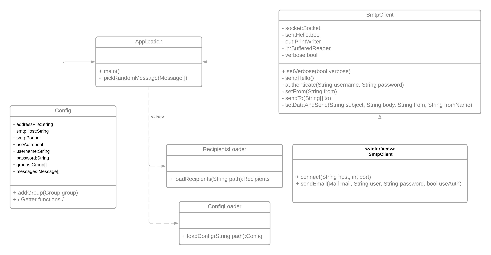
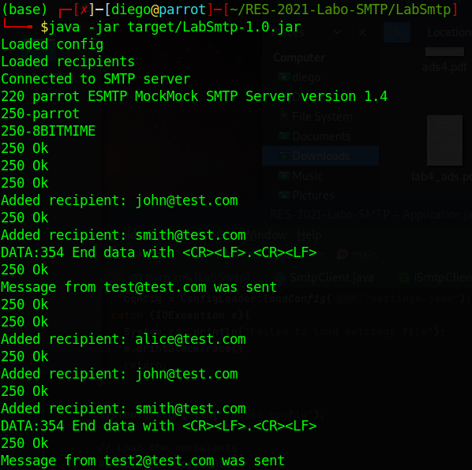

# RES-2021-Labo-SMTP

## Description
This project was done for the RES course at HEIG-VD.
The goal of the project was to build a tcp client application that could communicate with an smtp server to send "prank" emails comming from fake email addresses.

## Mock Smtp Server
To test the application, we have added a Docker image containing a mock Smtp server called MockMock that will display any emails sent.

### Installation
Go to the `Mock` directory and run 

```
$ docker build -t mockmock .
```
Once the image is built run the following command to start the container

```
$ docker run -p 25000:25000 -p 8282:8282 mockmock
```
You can change the ports to bind to the ports of your choice.


## Usage
Start by clonning this repository and entering it.
```
$ git clone https://github.com/TheSnekySnek/RES-2021-Labo-SMTP.git
$ cd RES-2021-Labo-SMTP/LabSmtp
```

Build the application by doing
```
$ mvn clean install
```

Now edit the configuration file `settings.json` with your configuration as well as the groups you want to form and the messages to use.

Do not forget to edit the `recipients.txt` file with the list of recipient emails.

To start the application you can do
```
$ java -jar target/LabSmtp-1.0.jar
```
## Implementation


The main class Application starts by loading the configuration via the `ConfigLoader` and makes sure it's valid. 

Then it loads the list of recipients from the recipient file specified in the config by using the `RecipientsLoader`. 

After that it picks a message to send for each group using the `pickMessage()` method and sends the mail using the SmtpClient

The `ConfigLoader` parses the `settings.json` using a json parser to extract the parameters as well as the groups and messages for the application to use by packing them in a Config object.

The `RecipientsLoader` parses the recipients file defined in the settings by reading each line as an address then in a Recipients object.

The `SmtpClient` is used to connect to the smtp server and send a given email via that server. It also implement `AUTH LOGIN` authentication.

## Example usage with verbose

